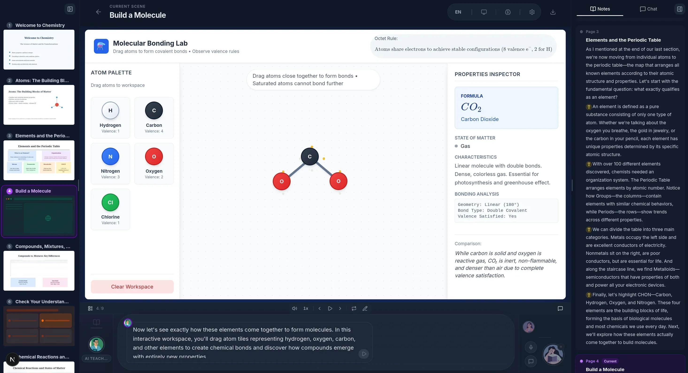

# Ember
**A truly local, offline-first generative learning environment.**

Describe a topic. Attach your documents. Ember constructs a complete interactive classroom with slides, quizzes, simulations, project-based learning, and delivers it with synthesized instructors and peers who speak, draw, debate, and respond in real time. All running on your hardware. No API keys. No cloud dependencies. No data extraction.



Ember is a comprehensive fork and optimization of the [OpenMAIC](https://github.com/THU-MAIC/OpenMAIC) research project, reimagined for sovereign, offline inference. The original OpenMAIC presents an elegant conceptual architecture for multi-agent educational orchestration, but its implementation assumes hyperscaler API dependency at every layer, making it practically nonfunctional for actual local deployment.

Every mainstream "AI education" platform operates on the same extractive model: Your learning materials, your conversations, your intellectual development is piped to remote infrastructure for analysis, profiling, and monetization. The pedagogical relationship becomes mediated by entities with interests fundamentally misaligned with your own.

Ember corrects this.

## What Ember Does Differently  

### Depth Over Dilution

Many educational systems, both virtual and traditional, treat the learner as a consumer to be managed rather than an intellect to be engaged. They optimize for throughput: pre-digesting complexity into consumable units, smoothing away difficulty to maintain engagement curves, replacing the friction of genuine understanding with the feedback loops of gamification. Ember inverts this logic entirely.

It is my goal to architect the semantic scaffolding to produce **generative friction** — learning that resists easy consumption. The system should treat you as an intellectual peer *capable of navigating ambiguity*, not a user profile to be optimized. When a concept demands complexity, the agents must follow it there; when truth is uncertain, they must acknowledge the limits rather than performing false confidence. The simulated debates should contradict each other when the material supports multiple valid positions. Quiz questions have no single correct answer when the subject doesn't provide one. The slides do not flatten ideas to fit attention spans; they expand the context to fit the ideas.

The golden thread here is education as **transformative capacity**, not transactional delivery. You are not accumulating information to be assessed; you are developing tools to think with. The generated classrooms persist not as static content libraries but as reusable intellectual equipment — simulations you can break, rebuild and expand yourself, arguments you can stress-test from new angles, concepts that remain tethered to the specific documents you brought rather than replaced by generic explanation. Learning compounds here because it remains yours to recombine.

Mainstream platforms assume that difficulty is a bug to be engineered out, that knowledge must be bite-sized to be digestible, that retention requires extrinsic reward. Ember assumes that **understanding requires work**, and that the work itself *is* the point. The goal is to sharpen the system for this specific labor: sustaining extended inquiry, preserving nuance across long-form discussion, allowing ideas to maintain their proper edges. This is **not** entertainment dressed as education. It is *craft* — precise, demanding, and entirely yours to direct.

### Local-First Inference Architecture

Ember treats local inference as a the primary environment, not a fallback. The system is tested and optimized against `llama-swap` and `llama.cpp`-based backends (via llama-server's OpenAI-compatible API) for:

- **Language model inference** — Full support for classroom generation, agent orchestration, and discussion flows using local GGUF models
- **Text-to-speech** — Integrated with local TTS backends (Chatterbox TTS via `llama-swap` is an excellent choice)
- **Speech recognition** — ASR via local Whisper implementations (`whisper.cpp` via `llama-swap`, for example)

The architecture supports heterogeneous inference: lightweight models for outline generation, stronger models for content creation, specialized models for specific agent personas — all configurable per-classroom, per-agent.

### Per-Agent, Per-Classroom Configuration

Unlike the monolithic model selection of the original, Ember supports granular inference configuration:

| Configuration Level | Control |
|---------------------|---------|
| **Global defaults** | System-wide provider and model preferences |
| **Per-classroom** | Override models, voices, and generation parameters for specific lessons |
| **Per-agent** | Assign distinct models and voices to individual teacher/peer agents |
| **Runtime resolution** | Automatic fallback chains when preferred models are unavailable |

This enables sophisticated pedagogical orchestration: a "professor" agent running a large reasoning model, "peer" agents on efficient instruct models, each with appropriate voice characteristics for role immersion.

### Persistent, Portable Classrooms

The original OpenMAIC stored generated media (TTS audio, images, simulations) exclusively in browser IndexedDB—ephemeral by design. Ember implements:

- **Server-side media persistence** — All generated assets stored on local filesystem with portable references
- **Browser audio caching** — Intelligent fetch-and-cache for playback performance without data loss, generate speech once, listen on any device
- **Classroom persistence** — Persist generated classrooms to server for easily loading on other computers or sharing in a ZIP file
- **Settings portability** — Full configuration export/import for reproducible deployments

### Corrected Multi-Agent Systems

The discussion and roundtable systems in OpenMAIC were architecturally sound but practically broken for local inference; runtime model resolution failures, prompt contexts that confused local models, no discussion TTS or voice differentiation between agents. Ember implements:

- **Robust runtime model resolution** — Fully configurable runtime models with proper fallback chains and error handling for local inference endpoints
- **Cleaned prompt architecture** — Removed assumptions about proprietary model behaviors; prompts now work reliably with local models
- **Per-agent TTS voices** — Each agent speaks with a distinct, configurable voice during discussions
- **Discussion TTS integration** — Full speech synthesis for multi-agent debates and conversations

### Operational Reliability

Local inference requires different operational patterns than API calls. Ember adds:

- **Configurable timeouts** — Generation timeouts adjustable for local hardware constraints
- **Introspection and debugging** — Complete prompt logging to disk for generation debugging
- **Keyboard navigation** — Full playback control without mouse dependency
- **PDF processing** — Working local document ingestion (multi-PDF upload, proper parsing)
- **Better agent registry** — Improved default agent filtering and profile injection into prompts


## Quick Start

### Requirements

- **Node.js** >= 20
- **pnpm** >= 10
- **Local inference backend(s)** — llama-server, faster-whisper-server, or equivalent OpenAI-compatible endpoints

### Installation

```bash
git clone https://github.com/markqvist/ember.git
cd ember
pnpm install
```

### Configuration

Configuring providers via the web UI (Settings → Providers) is the easiest. Simply open the web UI and add your custom endpoints as providers.

Or, create `.env.local`:

```bash
cp .env.example .env.local
```

For local `llama.cpp` inference:

```env
# Example: local llama-server for LLM inference
OPENAI_BASE_URL=http://localhost:8080/v1
OPENAI_API_KEY=sk-dummy-key-required-by-openai-format

# Example: local faster-whisper for ASR
ASR_OPENAI_BASE_URL=http://localhost:8000/v1
ASR_OPENAI_API_KEY=sk-dummy

# Example: local Piper/Coqui TTS server
TTS_OPENAI_BASE_URL=http://localhost:5000/v1
TTS_OPENAI_API_KEY=sk-dummy
```

All configuration can be exported/imported via Settings → General for rapid deployment across machines.

### Run

```bash
pnpm dev
```

Access at `http://localhost:3000`.

### Production Build

```bash
pnpm build && pnpm start
```

---

## Comparison: Ember vs. OpenMAIC

| Aspect | OpenMAIC | Ember |
|--------|----------|-------|
| **Primary target** | Cloud API users | Local/offline inference |
| **Local LLM support** | Broken (hardcoded timeouts, bad prompts) | First-class, optimized |
| **Local TTS/ASR** | Non-functional | Fully supported |
| **Media persistence** | IndexedDB only (ephemeral) | Server-side filesystem + browser cache |
| **Per-agent config** | None | Per-classroom, per-agent model/voice |
| **Runtime resolution** | Fails on local endpoints | Proper fallback chains |
| **Timeout handling** | Fixed at 300s | Configurable for your hardware |
| **Prompt debugging** | None | Full introspection logging |
| **Keyboard control** | None | Complete navigation |
| **Settings portability** | Manual env configuration | Export/import UI |
| **Multi-PDF upload** | Single file only | Multiple documents |
| **User profile injection** | Broken (not in prompts) | Fixed |
| **Meaningful Context** | Arbitrarily small limits | Can provide meaningful context |

## Support Ember
If you value education, please help support the continued development of this open, free and locally viable learning tool via one of the following channels:

- Monero:
  ```
  84FpY1QbxHcgdseePYNmhTHcrgMX4nFfBYtz2GKYToqHVVhJp8Eaw1Z1EedRnKD19b3B8NiLCGVxzKV17UMmmeEsCrPyA5w
  ```
- Bitcoin
  ```
  bc1pgqgu8h8xvj4jtafslq396v7ju7hkgymyrzyqft4llfslz5vp99psqfk3a6
  ```
- Ethereum
  ```
  0x91C421DdfB8a30a49A71d63447ddb54cEBe3465E
  ```
- Liberapay: https://liberapay.com/Reticulum/

- Ko-Fi: https://ko-fi.com/markqvist

## Feature Status

| Feature | Status | Notes |
|---------|--------|-------|
| Lesson generation (outline → scenes) | ✅ Complete | Optimized for local model capabilities |
| Slide lectures with TTS | ✅ Complete | Per-agent voice configuration |
| Interactive quizzes | ✅ Complete | Local inference for grading/feedback |
| Multi-agent discussion | ✅ Complete | Per-agent voices, per-agent inference config |
| Roundtable debate | ✅ Complete | TTS for all participants |
| Speech recognition | ✅ Complete | Local Whisper integration |
| Classroom persistence | ✅ Complete | Server-side media storage |
| Keyboard navigation | ✅ Complete | Full playback control |
| Settings export/import | ✅ Complete | Portable configuration |
| PDF import | ✅ Complete | Multi-document upload |
| Generation introspection | ✅ Complete | Prompt logging to disk |
| Per-classroom inference config | ✅ Complete | Model/voice overrides per lesson |
| Per-agent model/voice config | ✅ Complete | Heterogeneous inference |
| HTML simulations | 🔄 In Progress | Self-contained, no external deps |
| Quick classroom export/import | 🔄 In Progress | Complete data portability |
| Per-slide editing | 🔄 In Progress | Raw JSON editor implemented |
| Local web search | 🔄 In Progress | Via local search API |
| Course prerequisite chains | 📋 Planned | Include previous courses as context |

---

**Ember** — *A fire that is yours to keep and nurture*